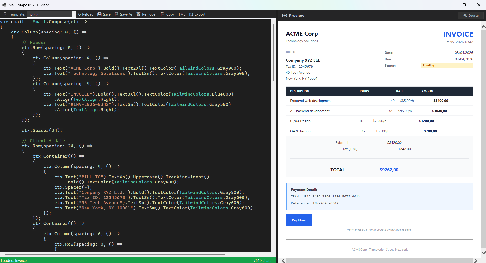

<p align="center">
  <strong>MailCompose.NET</strong><br />
  <em>Declarative Email UI for .NET</em>
</p>


<p align="center">
  <a href="#quick-start">Quick Start</a> ·
  <a href="#api-reference">API</a> ·
  <a href="#examples">Examples</a> ·
  <a href="#themes">Themes</a> ·
  <a href="#editor">Editor</a> ·
  <a href="#architecture">Architecture</a>
</p>

---

Build beautiful, responsive HTML emails in C# using a **declarative composition API** inspired by Jetpack Compose and MailBody -> https://github.com/doxakis/MailBody. 

Generates **email-safe HTML** (tables + inline styles) compatible with **Outlook, Gmail, Apple Mail, Yahoo**, and all major clients.

```
C# lambdas  →  Node tree  →  Email-safe HTML
```

## Why MailCompose.NET?

| Feature | Description |
|---------|-------------|
| **Declarative** | Describe *what* you want, not *how* — nested lambdas mirror your email structure |
| **Type-safe** | Enums and typed styles instead of magic strings |
| **Fluent API** | Tailwind CSS-inspired utilities: `.Bold().TextLg().Bg(TailwindColors.Blue600)` |
| **Email-safe** | Tables for layout, 100% inline styles, zero JavaScript |
| **Composable** | Nest `Column`, `Row`, `Container` freely — just like real UI frameworks |
| **Themeable** | Built-in Default, Dark, Minimal themes — or create your own |
| **Full Tailwind palette** | All Tailwind CSS colors as strongly-typed constants |

## Editor
The project includes a **live email editor** i you want to create email with the MailCompose.NET library while having a live preview, you can use the MailCompose.NET.Editor



## Installation

```bash
dotnet add package MailCompose.NET
```

> **Requirements**: .NET 10.0+

## Quick Start

```csharp
using MailCompose;

var email = Email.Compose(ctx =>
{
    ctx.Column(spacing: 16, () =>
    {
        ctx.Heading("Hello, John!", level: 2)
            .TextColor(TailwindColors.Gray900);

        ctx.Text("Thanks for your purchase.")
            .TextColor(TailwindColors.Gray600);

        ctx.Button("View Order", "https://example.com/order/123")
            .Background(TailwindColors.Blue600);
    });
});

email.WithTheme(t =>
{
    t.Title = "Order Confirmation";
    t.FooterText = "© 2026 Example Corp";
});

string html = email.Render();
```

**Output**: A complete HTML document (`<!DOCTYPE html>` ...) with reset CSS, centered layout, and inline styles — ready to send.

## API Reference

### Entry Point

```csharp
EmailDocument email = Email.Compose(ctx =>
{
    // Use ctx.* to build your email
});
```

`Email.Compose()` creates a composition context, builds a node tree from your lambdas, and returns an `EmailDocument` you can render.

### Containers

Containers hold child elements and control layout.

| Method | Description |
|--------|-------------|
| `ctx.Column(spacing?, padding?, content)` | Stacks children **vertically** (one below another) |
| `ctx.Row(spacing?, padding?, content)` | Aligns children **horizontally** (side by side) |
| `ctx.Container(content)` | Generic wrapper (card, section, quote block) |

```csharp
ctx.Column(spacing: 16, () =>
{
    ctx.Row(spacing: 12, () =>
    {
        ctx.Container(() =>
        {
            ctx.Text("Card content").Bold();
        }).Bg(TailwindColors.Gray50).P(20).RoundedLg();
    });
});
```

### Elements

Leaf nodes that render visible content.

| Method | Description |
|--------|-------------|
| `ctx.Text(content)` | Paragraph text |
| `ctx.Heading(content, level)` | Heading h1–h4 (auto-sized) |
| `ctx.Button(label, href?)` | CTA button (bulletproof email button with table) |
| `ctx.Image(src, alt, width?, height?)` | Image |
| `ctx.Link(href, text)` | Inline text link |
| `ctx.Divider(color?, thickness?, marginVertical?)` | Horizontal rule |
| `ctx.Spacer(height?)` | Vertical space (default 16px) |

### Control Flow

```csharp
// Iterate
ctx.ForEach(products, product =>
{
    ctx.Text(product.Name).Bold();
    ctx.Text($"${product.Price:F2}").TextColor(TailwindColors.Gray600);
});

// Conditional (if/else)
ctx.When(isPremium,
    ifTrue:  () => ctx.Text("⭐ Premium Member"),
    ifFalse: () => ctx.Button("Upgrade", "/upgrade")
);

// Conditional (if only)
ctx.When(showBanner, () =>
{
    ctx.Image("https://example.com/banner.png", "Sale", width: 600);
});
```

### Fluent Styles

Every element returns a typed node that supports **chainable style methods**, inspired by Tailwind CSS utilities.

```csharp
ctx.Text("Important notice")
    .Bold()
    .TextLg()
    .TextColor(TailwindColors.Red600)
    .Center()
    .Bg(TailwindColors.Red50)
    .P(16)
    .RoundedLg()
    .ShadowSm()
    .LeadingRelaxed();
```

#### Typography

| Method | CSS | Example |
|--------|-----|---------|
| `.TextXs()` ... `.Text9Xl()` | font-size + line-height | `.TextLg()` → 18px/28px |
| `.FontSize(px)` | font-size | `.FontSize(14)` → 14px |
| `.Bold()`, `.SemiBold()`, `.Medium()`, `.Light()`, `.Thin()` | font-weight | |
| `.Italic()`, `.NotItalic()` | font-style | |
| `.Underline()`, `.NoUnderline()`, `.LineThrough()` | text-decoration | |
| `.Uppercase()`, `.Lowercase()`, `.Capitalize()` | text-transform | |
| `.FontSans()`, `.FontSerif()`, `.FontMono()` | font-family | |
| `.Font(family)` | font-family | `.Font("Georgia, serif")` |
| `.LeadingTight()` ... `.LeadingLoose()` | line-height | multipliers: 1.25–2.0 |
| `.Leading(px)` | line-height | `.Leading(24)` → 24px |
| `.TrackingTight()` ... `.TrackingWidest()` | letter-spacing | |
| `.Tracking(px)` | letter-spacing | |
| `.Truncate()` | ellipsis + overflow + nowrap | |

#### Text Alignment

| Method | CSS |
|--------|-----|
| `.TextLeft()`, `.TextCenter()`, `.TextRight()`, `.TextJustify()` | text-align |
| `.Center()` | text-align: center (shorthand) |
| `.Align(TextAlign.Right)` | text-align |

#### Colors

| Method | Description |
|--------|-------------|
| `.TextColor(color)` or `.Text(color)` | Sets text color |
| `.Background(color)` or `.Bg(color)` | Sets background color |
| `.BorderColor(color)` | Sets border color |

All Tailwind CSS colors available as `TailwindColors.*`:

```csharp
TailwindColors.Blue600    // "#2563eb"
TailwindColors.Gray100    // "#f3f4f6"
TailwindColors.Red500     // "#ef4444"
TailwindColors.Emerald700 // "#047857"
```

**Full palette**: Slate, Gray, Zinc, Red, Orange, Amber, Yellow, Green, Emerald, Teal, Cyan, Sky, Blue, Indigo, Violet, Purple, Fuchsia, Pink, Rose — each with shades 50–900 — plus White, Black, Transparent.

#### Spacing

| Method | CSS | Description |
|--------|-----|-------------|
| `.P(px)` | padding | All sides |
| `.Px(px)` | padding-left + right | Horizontal |
| `.Py(px)` | padding-top + bottom | Vertical |
| `.Pt(px)`, `.Pb(px)`, `.Pl(px)`, `.Pr(px)` | individual padding | Per side |
| `.M(px)` | margin | All sides |
| `.Mx(px)`, `.My(px)` | margin | Horizontal / Vertical |
| `.Mt(px)`, `.Mb(px)`, `.Ml(px)`, `.Mr(px)` | individual margin | Per side |

#### Borders

| Method | Description |
|--------|-------------|
| `.Border(width?, color?, style?)` | All sides |
| `.Border2(color?)`, `.Border4(color?)` | Preset widths |
| `.BorderT()`, `.BorderB()`, `.BorderL()`, `.BorderR()` | Per side |
| `.BorderX()`, `.BorderY()` | Horizontal / Vertical |
| `.BorderDashed()`, `.BorderDotted()`, `.BorderDouble()` | Border style |
| `.Rounded()`, `.RoundedSm()` ... `.RoundedFull()` | Border radius |
| `.Rounded(px)` | Custom radius |
| `.RoundedT(px)`, `.RoundedB(px)` | Top / Bottom corners |
| `.RoundedTl(px)`, `.RoundedTr(px)`, `.RoundedBl(px)`, `.RoundedBr(px)` | Individual corners |

#### Dimensions

| Method | Description |
|--------|-------------|
| `.W(px)` or `.W(string)` | Width |
| `.WFull()`, `.WHalf()`, `.WThird()`, `.WQuarter()` | Percentage widths |
| `.H(px)` or `.H(string)` | Height |
| `.Size(px)` | Square (width & height) |
| `.MaxW(px)`, `.MaxWXs()` ... `.MaxW3Xl()`, `.MaxWProse()` | Max width |
| `.MinW(px)`, `.MinH(px)`, `.MaxH(px)` | Min/max height |

#### Layout & Effects

| Method | Description |
|--------|-------------|
| `.Block()`, `.InlineBlock()`, `.Inline()`, `.Hidden()` | Display |
| `.AlignTop()`, `.AlignMiddle()`, `.AlignBottom()` | Vertical align |
| `.OverflowHidden()`, `.OverflowAuto()` | Overflow |
| `.Shadow()`, `.ShadowSm()` ... `.Shadow2Xl()`, `.ShadowInner()` | Box shadow |
| `.Opacity(0.5)`, `.Opacity50()` | Opacity |

### Themes

```csharp
// Built-in themes
email.WithTheme(EmailTheme.Default);  // Clean, light gray background
email.WithTheme(EmailTheme.Dark);     // Dark mode
email.WithTheme(EmailTheme.Minimal);  // White, no outer bg, no radius

// Custom theme
email.WithTheme(t =>
{
    t.Title = "My Email";
    t.FontFamily = "'Georgia', serif";
    t.BaseFontSize = 16;
    t.BaseTextColor = TailwindColors.Gray800;
    t.BodyBackground = TailwindColors.Blue50;
    t.ContentBackground = TailwindColors.White;
    t.ContentMaxWidth = 640;
    t.ContentPadding = 32;
    t.ContentBorderRadius = 12;
    t.FooterText = "© 2026 My Company";
});

// Brand theme
email.WithTheme(EmailTheme.Brand("#2563eb"));
```

| Property | Default | Description |
|----------|---------|-------------|
| `Title` | `""` | HTML `<title>` tag |
| `FontFamily` | System stack | Base font family |
| `BaseFontSize` | 16 | Base font size (px) |
| `BaseTextColor` | Gray800 | Default text color |
| `BaseLineHeight` | "1.5" | Base line height |
| `BodyBackground` | Gray100 | Outer background |
| `ContentBackground` | White | Content area background |
| `ContentMaxWidth` | 600 | Content max width (px) |
| `ContentPadding` | 32 | Content padding (px) |
| `ContentBorderRadius` | 8 | Content border radius (px) |
| `FooterText` | null | Footer text (null to hide) |

### Rendering

```csharp
// Full HTML document (DOCTYPE + html + head + body)
string fullHtml = email.Render();

// Pretty-printed (for debugging)
string pretty = email.Render(pretty: true);

// Body only (for injecting into existing templates)
string bodyOnly = email.RenderBody();

// Debug: view the node tree
Console.WriteLine(email.DumpTree());
// Column(spacing=16, padding=0)
//   Text("Hello, John!")
//   Button("View Order")
```

## Examples

The project includes **15 example emails** covering progressively complex patterns:

### Basic (1–7)

| # | Name | Features used |
|---|------|---------------|
| 1 | **Email Confirmation** | Column, Heading, Text, Button, Italic, TextColor |
| 2 | **Password Reset** | Divider, footer theme, FontSize |
| 3 | **Order Confirmation** | ForEach, Row, computed values (Sum), Align |
| 4 | **Notification** | Container (quote block), Background, Padding, Rounded |
| 5 | **Welcome** | Image, 3-column Row, nested Column, Center, Spacer |
| 6 | **Dark Theme** | `EmailTheme.Dark` preset |
| 7 | **Conditional** | When (if/else), ForEach, conditional rendering |

### Advanced (8–15)

| # | Name | Features used |
|---|------|---------------|
| 8 | **E-Commerce Shipment** | Hero header, tracking timeline, product list with images, cost breakdown, shipping address, Bg, P, RoundedT, TextSm, TextXs, BorderB, BorderL, RoundedLg |
| 9 | **Newsletter Digest** | Branded header, featured article card, 2-column grid, category badges (RoundedFull), ShadowSm, LeadingTight, TrackingWidest, Uppercase |
| 10 | **Dashboard Report** | KPI cards row, data table with header, trend indicators (conditional color), Insights callout, Bg, Border, OverflowHidden |
| 11 | **Invoice** | Two-column header, bill-to section, services table with totals, tax calculation, payment info, FontMono, TrackingWidest, RoundedT/B |
| 12 | **Activity Summary** | Avatar, stats cards with icons, activity timeline, streak badge, Size, RoundedFull, Text2Xl |
| 13 | **Event Invitation** | Hero banner, feature highlights, speaker grid with avatars, pricing cards (Early Bird vs VIP), LineThrough, RoundedFull, Text4Xl |
| 14 | **Security Alert** | Alert banner, sign-in details table, dual-action buttons (confirm/block), security recommendations, BorderL callout |
| 15 | **Subscription Renewal** | Minimal theme, FontSerif, clean data table, link row, no footer |

### Running the examples

```bash
cd Example
dotnet run
```

All HTML files are generated in the `Output/` folder. Open them in any browser to preview.


### Running the editor

```bash
cd Editor
dotnet run
```

### Template format

Templates are plain `.txt` files in the `Templates/` folder. The editor wraps them with:

**Header** (`_Header.txt`):
```csharp
using MailCompose;
using MailCompose.Nodes;
using System.Linq;
```

**Footer** (`_Footer.txt`):
```csharp
return html;
```

Your template code goes between them. The variable `html` (the rendered string) is what gets displayed.

## Architecture

```
MailCompose/
├── Email.cs                    → Entry point: Email.Compose()
├── EmailScope.cs               → Composition functions (Text, Column, Row, etc.)
├── ComposeContext.cs            → Stack-based tree builder
├── EmailDocument.cs             → Document + Render() + DumpTree()
├── EmailTheme.cs                → Theme configuration & presets
├── NodeStyle.cs                 → Typed inline CSS properties
├── NodeStyleExtensions.cs       → Fluent API (.Bold(), .P(), .Bg(), etc.)
├── HtmlWriter.cs                → Email-safe HTML writer
├── Enums.cs                     → TextAlign, FontWeight, Display, etc.
├── TailwindColors.cs            → Full Tailwind CSS color palette
├── TailwindPresets.cs           → Spacing, sizing, shadow, radius scales
└── Nodes/
    ├── EmailNode.cs             → Abstract base (Style, Children, Render)
    ├── TextNode.cs              → <p> / <h1>–<h4>
    ├── ColumnNode.cs            → Vertical stack (table rows)
    ├── RowNode.cs               → Horizontal layout (table cells)
    ├── ContainerNode.cs         → Generic wrapper (styled <td>)
    ├── ButtonNode.cs            → Bulletproof CTA (table + <a>)
    ├── ImageNode.cs             →  with attributes
    ├── LinkNode.cs              → <a> link
    ├── DividerNode.cs           → <hr> styled
    └── SpacerNode.cs            → Empty <div> with height
```

### How it works

1. **`Email.Compose(ctx => { ... })`** creates a `ComposeContext` (ThreadStatic stack)
2. Your lambda calls `ctx.Text()`, `ctx.Column()`, etc. — each call creates a node and pushes/pops from the stack
3. Container methods (`Column`, `Row`, `Container`) use `Open()` to push themselves, execute the child lambda, then pop
4. The result is an `EmailDocument` with a tree of `EmailNode` objects
5. **`Render()`** walks the tree, using `HtmlWriter` to generate email-compatible HTML:
   - Tables for layout (not flexbox/grid)
   - 100% inline styles
   - Proper `role="presentation"` on layout tables
   - HTML-encoded text content
   - Reset CSS in `<head>`

### HTML output characteristics

- ✅ Tables for layout (Outlook compatible)
- ✅ 100% inline styles (no external CSS)
- ✅ Reset CSS for cross-client consistency
- ✅ `role="presentation"` on layout tables
- ✅ HTML-escaped content
- ✅ Bulletproof buttons (table-based)
- ✅ Compatible: Outlook, Gmail, Apple Mail, Yahoo, Thunderbird

## Project Structure

```
MailCompose.NET/
├── MailCompose.NET.slnx         → Solution file
├── MailCompose/                  → Core library (.NET 10.0)
├── Example/                     → 15 example emails (console app)
├── Tests/                       → xUnit tests
├── Editor/                      → Live editor (WinForms + Roslyn)
└── Output/                      → Generated HTML files
```

## Testing

```bash
cd Tests
dotnet test
```

22 tests covering tree building, rendering, styles, themes, and edge cases.

## License

MIT
